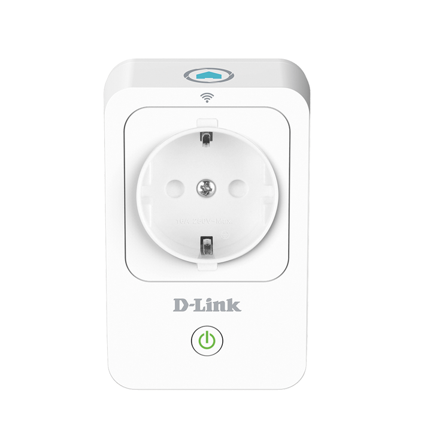
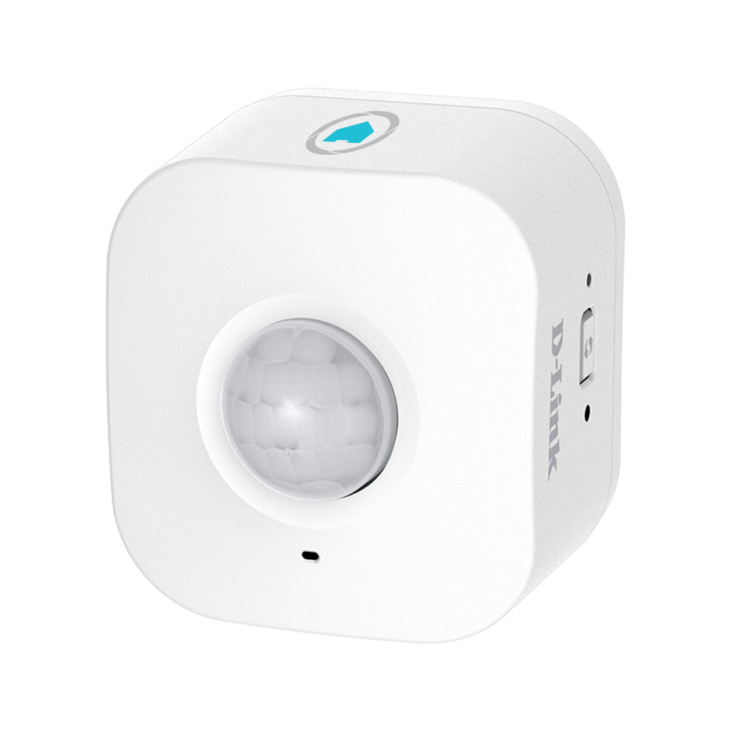

# ioBroker.mydlink

<!---   

 --->

MyDlink Adapter for ioBroker. 
------------------------------------------------------------------------------

Allows to control power sockets or motion detectors from [D-Link](https://eu.dlink.com/uk/en/for-home/smart-home) from within ioBroker. 

Currently tested devices:

| Model | Type  | Image |
| :---: | :---: | :---: |
| [DSP-W215](https://eu.dlink.com/uk/en/products/dsp-w215-smart-plug) | Socket (socket, temperature, current) |  | 
| [DCH-S150](https://eu.dlink.com/uk/en/products/dch-s150-motion-sensor) | Motion Detector (last motion detected) |  |

The adapter needs to poll the devices. So sensor readings and motion detection will be 
delayed by polling interval (can be set in config)

In config there is a list where you need to specify IP and PIN for every device. 
The PIN is printed on the bottom of the device.

The adapter does not interfere with the use of the app.

## Changelog

### 0.0.1
* (Garfonso) initial release

## License
MIT License

Copyright (c) 2019 Garfonso <garfonso@mobo.info>

Permission is hereby granted, free of charge, to any person obtaining a copy
of this software and associated documentation files (the "Software"), to deal
in the Software without restriction, including without limitation the rights
to use, copy, modify, merge, publish, distribute, sublicense, and/or sell
copies of the Software, and to permit persons to whom the Software is
furnished to do so, subject to the following conditions:

The above copyright notice and this permission notice shall be included in all
copies or substantial portions of the Software.

THE SOFTWARE IS PROVIDED "AS IS", WITHOUT WARRANTY OF ANY KIND, EXPRESS OR
IMPLIED, INCLUDING BUT NOT LIMITED TO THE WARRANTIES OF MERCHANTABILITY,
FITNESS FOR A PARTICULAR PURPOSE AND NONINFRINGEMENT. IN NO EVENT SHALL THE
AUTHORS OR COPYRIGHT HOLDERS BE LIABLE FOR ANY CLAIM, DAMAGES OR OTHER
LIABILITY, WHETHER IN AN ACTION OF CONTRACT, TORT OR OTHERWISE, ARISING FROM,
OUT OF OR IN CONNECTION WITH THE SOFTWARE OR THE USE OR OTHER DEALINGS IN THE
SOFTWARE.
